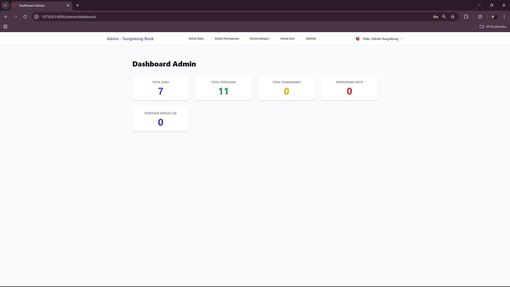
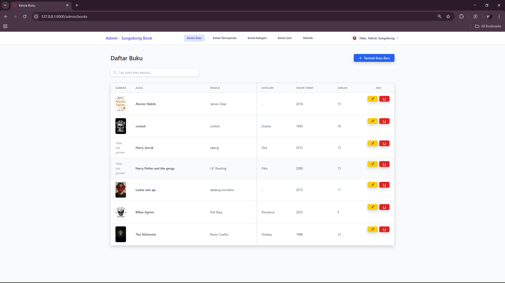
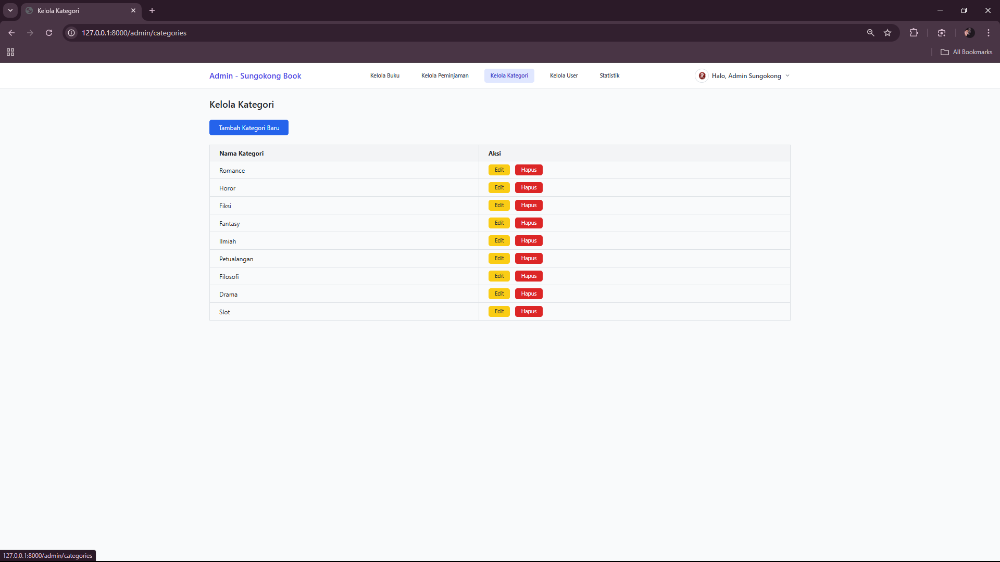
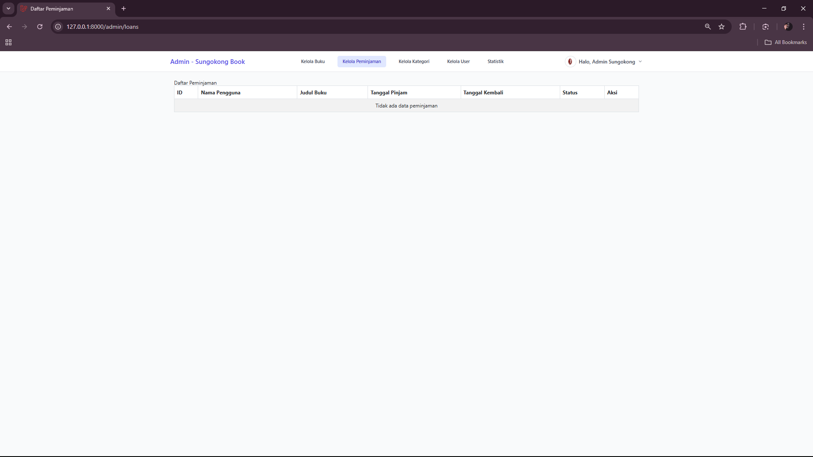
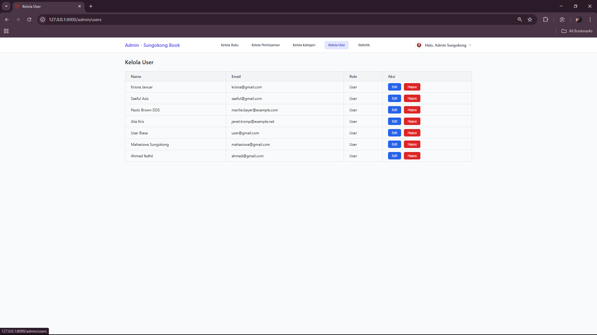
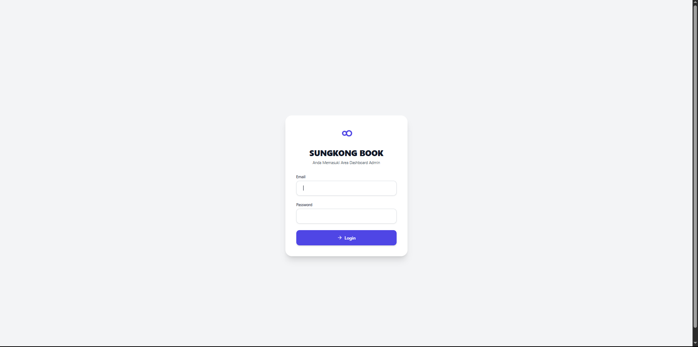

# SUNGOKONG BOOK - API Backend Laravel 11

Sistem backend API untuk aplikasi perpustakaan digital **SUNGOKONG BOOK** menggunakan Laravel 11 dan Sanctum.  
Dirancang untuk mendukung aplikasi mobile Flutter dengan fitur lengkap autentikasi, manajemen buku, peminjaman, review, serta dashboard admin dan staff.

---

## Fitur Utama

- **Autentikasi & Otorisasi**
  - Registrasi, login, logout menggunakan Laravel Sanctum (token-based)
  - Role-based access control (Admin, Staff, User)

- **Manajemen Buku**
  - CRUD buku lengkap dengan kategori
  - Upload cover buku dan avatar user
  - Filter buku berdasarkan kategori dan rating

- **Peminjaman Buku**
  - Peminjaman buku oleh user
  - Tracking status peminjaman (dipinjam, dikembalikan, terlambat)
  - Kelola peminjaman oleh admin/staff

- **Review Buku**
  - User dapat memberikan rating dan ulasan pada buku
  - Statistik rating buku

- **Profil User**
  - Lihat dan edit profil, termasuk avatar

- **Dashboard Admin & Staff**
  - Kelola data buku, kategori, peminjaman, dan user
  - Statistik penggunaan aplikasi

---

## Struktur API

- `POST /api/register` — Registrasi user baru
- `POST /api/login` — Login dan dapatkan token
- `POST /api/logout` — Logout dan hapus token
- `GET /api/me` — Profil user saat ini
- `GET /api/books` — Daftar buku dengan filter dan pagination
- `POST /api/books` — Tambah buku (Admin/Staff)
- `PUT /api/books/{id}` — Update buku (Admin/Staff)
- `DELETE /api/books/{id}` — Hapus buku (Admin/Staff)
- `GET /api/loans` — Daftar peminjaman user
- `POST /api/loans` — Pinjam buku
- `PUT /api/loans/{id}/return` — Kembalikan buku
- `POST /api/reviews` — Tambah review buku
- `GET /api/admin/users` — Kelola user (Admin)
- ...dan lain-lain sesuai dokumentasi lengkap.

---

## Instalasi

1. Clone repository ini:
   ```bash
   git clone https://github.com/dhiljaa/library_management.git
   cd library_management
``

2. Install dependencies:

   ```bash
   composer install
   ```

3. Salin file environment dan konfigurasi:

   ```bash
   cp .env.example .env
   php artisan key:generate
   ```

   Sesuaikan konfigurasi database dan mail di `.env`.

4. Buat symbolic link storage untuk akses file publik:

   ```bash
   php artisan storage:link
   ```

5. Libray Pdf:

   ```bash
   composer require barryvdh/laravel-snappy
   ```
   
6. Migrasi dan seed database:

   ```bash
   php artisan migrate --seed
   ```

7. Jalankan server:

   ```bash
   php artisan serve
   ```

---

## Testing

Untuk menjalankan automated feature tests:

```bash
php artisan test
```

---

---

## Screenshots

Screenshot hasil tampilan dan fitur CRUD Backend:


  
  
  
  
  



## Struktur Folder Penting

* `app/Models` — Model Eloquent (User, Book, Loan, Review, Category)
* `app/Http/Controllers/API` — Controller API untuk fitur frontend Flutter
* `app/Http/Controllers/Admin` — Controller dashboard admin/staff
* `routes/api.php` — Definisi route API dengan middleware auth dan role
* `database/migrations` — Skrip migrasi database
* `storage/app/public/avatars` — Folder untuk file avatar user
* `resources/views/admin` — Blade templates dashboard admin

---

## Teknologi

* Laravel 11
* PHP 8.2
* Laravel Sanctum (API Token Authentication)
* MySQL (database)
* PHPUnit (testing)

---

## Kontribusi

Kontribusi sangat disambut! Silakan fork repository ini dan buat pull request dengan fitur baru atau perbaikan bug.

---

## Lisensi

MIT License © 2025 Sungokong Book Team

---

Jika ada pertanyaan, silakan hubungi melalui \[[ahmadfadhil289@hmail.com](mailto:ahmadfadhil289@gmail.com)].

---

**SUNGOKONG BOOK** — Solusi digital untuk perpustakaan modern.

```

